<!-- If the banner doesn't load on the org page, swap the src above for:
     https://raw.githubusercontent.com/Team-MaRo/.github/master/profile/assets/banner.svg -->

# Team MaRo マロ

**Team MaRo** (マロ) is the shared home of **Manuele** ([@D3strukt0r](https://github.com/D3strukt0r))
and **Robine** ([@Rubynnn](https://github.com/Rubynnn)) — a husband-and-wife duo who love Japan,
anime, and making things together. This org hosts both our personal experiments and the projects
we build side by side: one of us reaching for the stars 🚀, the other growing something beautiful 🌿.

---

## 👋 Meet the team

<table>
<tr>
<td width="50%" valign="top">

### 🚀 Manuele · [@D3strukt0r](https://github.com/D3strukt0r)

Reaching for **space and rockets**, powered by a healthy obsession with the color **red**.
Always launching the next idea.

</td>
<td width="50%" valign="top">

### 🌿 Robine · [@Rubynnn](https://github.com/Rubynnn)

Tending **plants and growing things**, with a heart set on the calm of **blue and green**.
Patient where rockets are loud.

</td>
</tr>
</table>

---

## 🌌 What we build

We build for the joy of it — personal side-projects, tools we needed and couldn't find, and the
occasional thing we make together. Some reach upward and fast like a rocket; others grow slowly
and steadily like a garden. Either way, it lands here under **Team MaRo**.

Most of our repositories fall back to the community docs in this `.github` repo —
[Code of Conduct](https://github.com/Team-MaRo/.github/blob/master/CODE_OF_CONDUCT.md),
[Contributing](https://github.com/Team-MaRo/.github/blob/master/CONTRIBUTING.md), and
[Security](https://github.com/Team-MaRo/.github/blob/master/SECURITY.md) — so every project starts
on solid ground.

---

⭐ 🚀 ・ 富士山 ・ 🌿 ⭐

*ありがとう — thanks for stopping by.*

